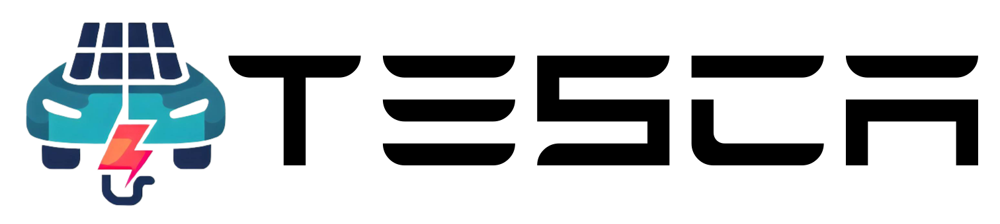

---

TESCA (Tesla Solar Charging Automation) is a program that aims to charge your Tesla vehicle with excess solar energy. The goal is to charge both the Tesla vehicle and a Tesla Powerwall evenly. The script is written in Python and uses the [TeslaPy API](https://github.com/tdorssers/TeslaPy).

## Changelog

Tesca Version: v.1.0.2
- Added logging system
- Changes structure
- Fixed minor bugs

Tesca Version: v.1.0.1
- Fixed minor bugs
- Added check if car battery is full

## What you'll need

* Tesla vehicle (obviously)
* Tesla Powerwall
* Solar Plant

## Introduction

The goal is to charge the Powerwall and the Tesla vehicle evenly. 
The fuller the Powerwall is, the more power is given to the Tesla vehicle to charge.
The excess power should be used in such a way that the Tesla vehicle is charged but both the current daily demand is covered and the Tesla Powerwall is full at the end of the day so that it can supply the house through the night.

## How does it work?

The program takes several measurements in certain time intervals and calculates the average value from them. This value is adjusted again and again during the day and changes the charging power of the Tesla vehicle. If the excess power is too little or it is drawn from the grid or the Powerwall, then the Tesla vehicle is not charged. The program starts at sunrise and ends at sunset.

## Installation

Clone the repository:
```
git clone https://github.com/Obedaya/Tesca.git
```

Go into the directory:
```
cd Tesca
```


In order to use the program you need to install all requirements:
```
pip install -r requirements.txt
```

## Usage

To use the program you need to configure the config file:
```
sudo nano config.yml
```

Run the script:
```
python main.py
```
It will automatically open your browser, where you'll have to sign in to your Tesla Account. Once your signed in, you'll see a "Page not found!" and have to copy the URL into the terminal.
